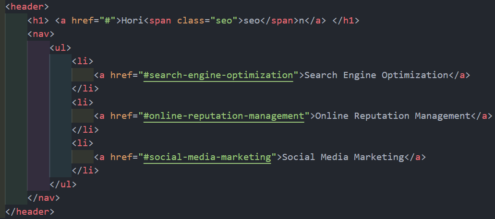
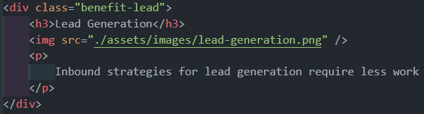

# HTML and CSS Refactoring

## Description

We're trying to make a better website by using semantic features, cleaner syntax and note repeating code.

## Features
Generic HTML elements were changed to semantic elements, for example:

div with generic class header: <br>


to tag header: <br>


### Consolidated CSS

Changing this:


To this:


Changing this:


In to this:


### Added accessibility attributes and concise elements.

Example adding the alt attribute in the images:



## Installation

To get the files you need to follow the instructions:

1. ```bash 
   git clone https://github.com/didierthomasm/HTML-and-CSS-Refactoring
    ```
 2. ```bash
    cd repository-name
    ```
3. Open the files in your favorite editor.


This is how the page looks like
